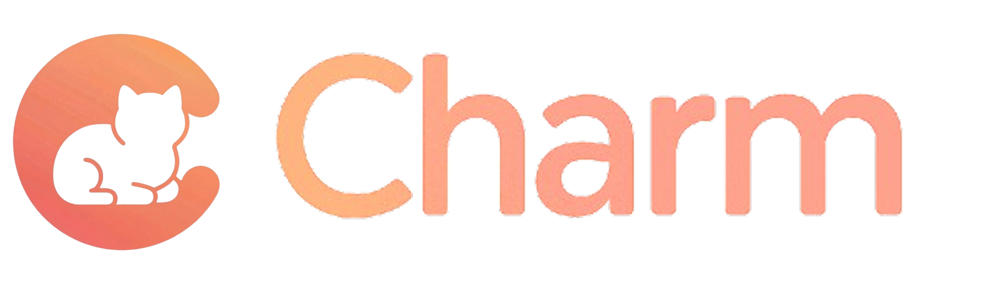

<p align="center">
  
</p>

[](https://github.com/CharmAIOS/Charm/actions) [](https://github.com/CharmAIOS/Charm/releases) [](https://discord.gg/gdakynHUEb) [](https://github.com/CharmAIOS/Charm/blob/main/LICENSE)


# Charm: The Unified Platform for Agentic Intelligence

**Charm** is a **Unified Application Layer** that provides a standardized architecture that enables agents to distribute, run, and scale across heterogeneous ecosystems, turning them into real, commercial-ready applications.

## Getting started

### Installation

Charm is available on PyPI. We recommend using [uv](https://github.com/astral-sh/uv) for the best experience.

#### Standard Setup (For Agent Development)

If you only want to build and define agents

```bash
uv add charmos
# or
pip install charmos
```

#### Advanced Setup (For Local Cloud Runner)

If you want to simulate the isolated cloud environment locally

```bash
uv add charmos[runner]
# or
pip install charmos[runner]
```

> **Note:** To use the docker simulation mode, you must have Docker Desktop or Docker Engine running on your machine.
>
### Register your agent

Read our simple [tutorial](https://github.com/CharmAIOS/Charm/blob/main/docs/getting-started/charm-store.md) to learn how to register your agent on the Charm Store.

## Contributing

To know how to contribute to Charm, please read our [contribution guide](https://github.com/CharmAIOS/Charm/blob/main/CONTRIBUTING.md).

## Contact

- Support and Questions: [Community](https://discord.gg/gdakynHUEb) / [Email](mailto:team@charmos.io)
- Join us: [Chat with us](mailto:uc@charmos.io)

## Changelog

Check our [updates](https://charmos.io/changelog)

## License

Charm is licensed under the [GNU Affero General Public License v3.0](https://github.com/CharmAIOS/CharmOS/blob/main/LICENSE)
