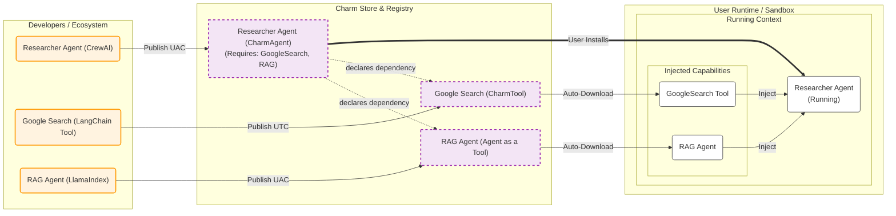

Charm is built upon five fundamental concepts that work together to transform isolated AI scripts into a governed, interoperable system.

>The current name is only a conceptual placeholder.

### CharmAgent
The CharmAgent is the fundamental atomic unit of the ecosystem. It is not a replacement for your existing code, but a standardized interface wrapper around agents built with any platform. By wrapping an agent with the Charm SDK, it gains a universal USB connector—a standard I/O schema and a lifecycle protocol defined by the Unified Agent Contract. This allows the agent to be recognized, loaded, and managed by the Charm system without rewriting its internal logic.
### CharmTool
CharmTool creates a neutral abstraction layer for external tools, services, and modules. It transforms them into standardized system capability modules that can be injected into CrewAI Agents, LangGraph workflows, or pure Python scripts, achieving a true decoupling of "capability" and "framework."
### Agent as a Tool
In Charm, a full-fledged intelligent agent can be wrapped and exposed as a simple CharmTool. This enables recursive composition, transforming agents from standalone entities into composable building blocks. Developers can use the exact same tool-use paradigm applied to CharmTools to construct complex, hierarchical multi-agent systems.
### Unified Runtime
The Unified Runtime serves as the "Operating System Kernel" for agentic applications. It is the execution environment responsible for reading the UAC, orchestrating the CharmAgent lifecycle, and performing Dependency Injection. The Runtime replaces the practice of hardcoding API keys and tools inside agents, instead dynamically provisioning resources, managing state persistence, and enforcing security policies at execution time. This ensures consistent agent behavior across local, cloud, or edge environments.
### Charm Store
The Charm Store is the distribution and governance layer of the ecosystem. It is a registry for publishing, discovering, and installing verifiable agentic behaviors. Unlike a simple code repository, the Store manages the Semantic Contract (UAC) of each agent, ensuring users know exactly what an agent does, what permissions it requires, and its expected input format. It also supports payment processing and user-end interaction interfaces, creating a trusted marketplace for developers to share and monetize agents as reusable commercial software artifacts.
